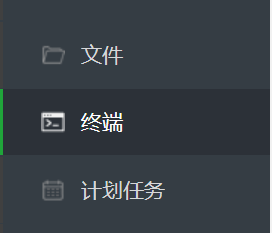
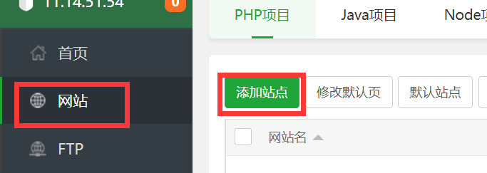
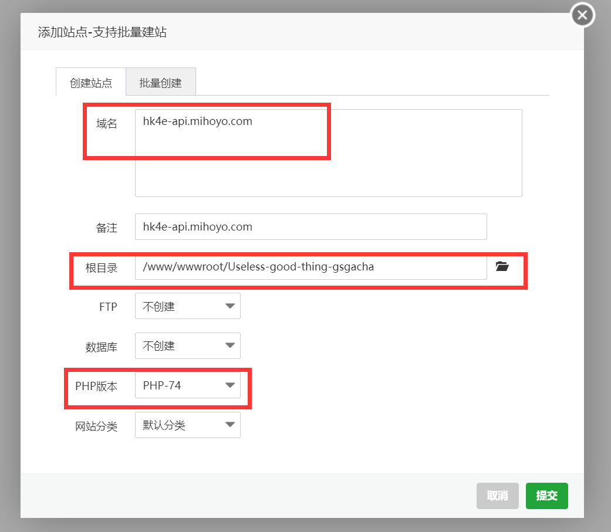
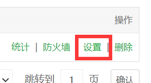
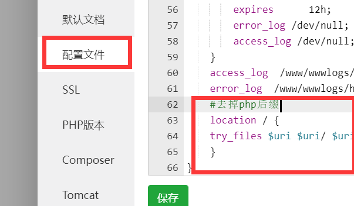

准备工具：\
1.一台服务器(自己的电脑也行，但是不建议，你问我苹果系统可不可以?¿当然不可以)\
2.一双有点小问题会自己百度一下的手 \
3.一个脑子 \
\
推荐工具：\
1.Navicat Premium 16数据库管理工具(不会吧不会吧，绿色版都不知道¿)\
\
前置操作： \
0.在服务器上安装宝塔面板!\
1.在服务器上安装mysql , php7.4 , nginx服务，一般首次进入宝塔面板都会跳出的。 \
ps:不可使用php8,只支持5-7,建议使用php7.4(开发/测试环境为php7.4) \
\
提示：宝塔面板在网站页面，点击网站后面的根目录的哪一行绿字可以直接前往那个文件夹 \
测试的环境选用centos7.8，部分命令可能存在出入，可自行百度！ \
\
操作流程: \
1.进入ssh(终端)，克隆项目(若跳出来密码错误，若为云服务器请前往控制台查看密码！) 
```bash
cd /www/wwwroot
git clone https://github.com/slzzInTheForest/Useless-good-thing-gsgacha.git
```
 \
2.前往宝塔面板网站页面→添加站点 \
 \
3.\
域名：hk4e-api.mihoyo.com \
根目录：/www/wwwroot/Useless-good-thing-gsgacha \
\
4.配置ssl证书，在面板网站界面点击 设置→SSL \
 \
5.前往github ssl文件夹复制证书([点击转跳](/ssl))\
(密钥：ssl.key证书：ssl.crt，别管宝塔提示的密钥为pem) \
5.也是在这个界面，点开 配置文件 将下述内容插入到 "#SSL-START SSL相关配置" 的上一行

```bash
    #去掉php后缀
    location / {
    try_files $uri $uri/ $uri.php?$args;
    }
```
6.将ssl文件夹中的CA.crt下载到你的电脑（可以复制文本，然后黏贴到电脑，然后重命名为CA.crt)，并且安装 \
(双击证书→安装证书→下一页→将所有证书放入：受信任的根证书颁发机构→下一页→完成) \
上面如果跳提示了就点确定就行了\
7.编辑本地hosts (你的ip hk4e-api.mihoyo.com) 例如(127.0.0.1 hk4e-api.mihoyo.com)\
8.前往面板数据库页面，添加数据库→（数据库名用户名密码看着写）→提交
9.打开config.php，将数据库等配置填入 \
10.(一定要重启浏览器)访问 hk4e-api.mihoyo.com/mysql.php (备注:如果设置key请在后面加上: ?key=你设置的key)\
11.然后就可以根据下面数据库的备注修改数据库，愉快的装逼了！
\
\